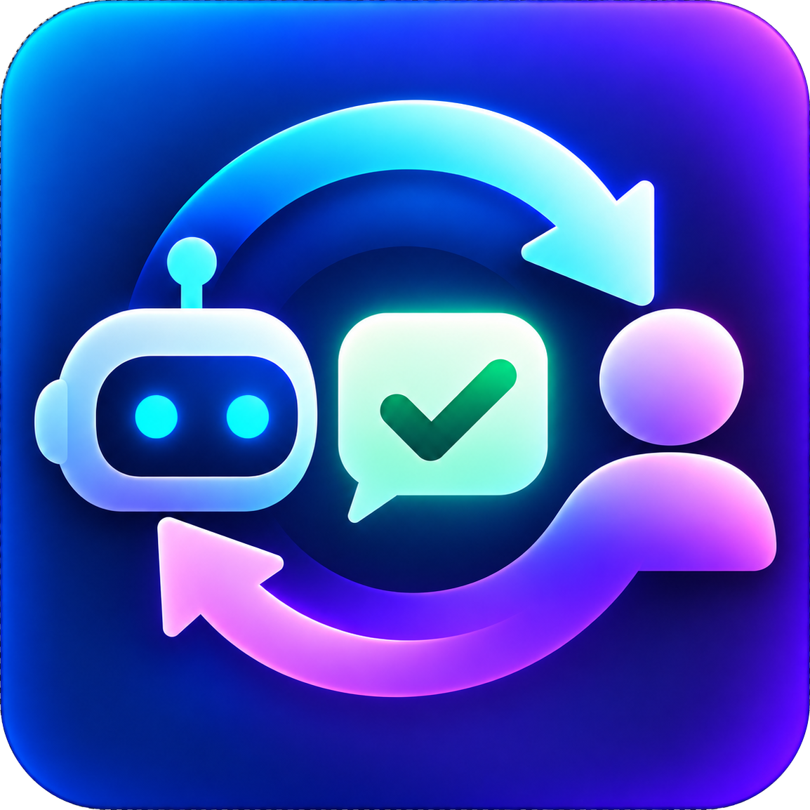

# Loopback



Human-in-the-loop for AI agents. An agent asks a question, your phone buzzes, you tap an option (or type your own answer), the agent carries on.

```
agent ──POST /api/requests──▶ Loopback server ──FCM push──▶ Android app
agent ◀── long-poll answer ── Loopback server ◀── answer ──  you
```

The prompt the phone shows mirrors Claude Code's `AskUserQuestion`: a title, optional markdown context, a list of options with descriptions (single or multi-select), and an optional free-text "my answer" field.

## Repo

| Dir | What |
|---|---|
| `LoopbackServer/` | Bun + TypeScript API server. SQLite storage, FCM push, long-polling. Zero runtime dependencies. |
| `LoopbackAndroid/` | Kotlin / Jetpack Compose app. Inbox, request detail, settings, push handling. |
| `LoopbackCLI/` | `loopback` CLI: installs the **Loopback skill** into Claude Code and Codex, and lets you ask from a terminal. |

## Server

```sh
cd LoopbackServer
cp .env.example .env          # set LOOPBACK_API_KEY (openssl rand -hex 32)
bun install                   # dev deps only (types)
bun run dev                   # http://localhost:8787
```

Push notifications need a Firebase project:

1. Firebase console → create a project → add an Android app with package `name.gornostal.loopback`.
2. Download `google-services.json` into `LoopbackAndroid/app/`.
3. Project settings → Service accounts → *Generate new private key* → save as `LoopbackServer/service-account.json` and point `FIREBASE_SERVICE_ACCOUNT` at it.
   On a host where you can't ship a file (Railway, etc.), set `FIREBASE_SERVICE_ACCOUNT_B64` to `base64 -w0 service-account.json` instead.

Without a service account the server still works; it just logs that it can't push, and the app shows requests when you open or pull-to-refresh it.

### API

All `/api` routes require `Authorization: Bearer <LOOPBACK_API_KEY>`.

| Method | Path | Purpose |
|---|---|---|
| `POST` | `/api/requests[?wait=N]` | Create a request. With `wait`, block up to N s (max 600) and return the answered request. |
| `GET` | `/api/requests?status=pending` | List. `status` = `pending` \| `answered` \| `cancelled` \| `all`. |
| `GET` | `/api/requests/:id` | Fetch one. |
| `GET` | `/api/requests/:id/wait?timeout=N` | Long-poll until answered or cancelled (returns current state on timeout). |
| `POST` | `/api/requests/:id/answer` | `{ "selected": ["Deploy"], "text": "but watch the logs" }` |
| `DELETE` | `/api/requests/:id` | Cancel; dismisses the phone notification. |
| `POST` | `/api/devices` | `{ "token", "platform", "name" }` — the app calls this itself. |

Create body:

```jsonc
{
  "title": "Deploy to production?",            // required; push title
  "context": "Tests **passed**.\n\n- 3 migrations\n- ~2 min downtime",  // markdown, optional
  "options": [                                 // optional; strings or {label, description}
    { "label": "Deploy", "description": "Ship it now" },
    { "label": "Hold" }
  ],
  "multiSelect": false,                        // default false
  "allowFreeText": true,                       // default true → shows "My answer" field
  "source": "deploy-bot"                       // shown in the inbox and notification
}
```

Request object (returned everywhere):

```jsonc
{
  "id": "052f…", "createdAt": "2026-10-02T09:53:08.483Z",
  "status": "pending" | "answered" | "cancelled",
  "title": "…", "context": "…", "options": [...], "multiSelect": false, "allowFreeText": true, "source": "…",
  "answer": null | { "selected": ["Deploy"], "text": "…", "answeredAt": "…" }
}
```

### Asking from an agent

The easiest path is the skill. Install it once:

```sh
cd LoopbackCLI && bun install && bun link      # puts `loopback` on your PATH
loopback install --url https://loopback.example.com --key <LOOPBACK_API_KEY>
```

This writes `~/.config/loopback/config.json` and installs `SKILL.md` + `scripts/loopback.mjs` into
`~/.claude/skills/loopback/` (Claude Code) and `~/.codex/skills/loopback/` (Codex). Use `--claude` or
`--codex` to pick one, `--project` to install into the current repo's `.claude/skills` / `.codex/skills`
instead, and `loopback uninstall` to remove.

The skill tells the agent when to reach for you and how to call the bundled script, which is plain Node
with no dependencies:

```sh
node ~/.claude/skills/loopback/scripts/loopback.mjs ask "Deploy api v2.3?" \
  --context "CI green. 1 migration." \
  --option "Deploy now :: run the migration and roll out" --option "Hold" \
  --source claude-code --timeout 300
# → {"id":"…","status":"answered","title":"…","answer":{"selected":["Deploy now"],"text":"watch error rates"}}
```

Humans can be slow, so the script supports two modes:

- **Blocking**: `ask … --timeout 300` long-polls and exits 0 with the answer, 2 if cancelled, or 3 if still
  pending. On 3 the agent re-runs `wait <id> --timeout 300` until it gets an answer.
- **Polling**: `ask … --no-wait` returns the id immediately; the agent keeps working and calls
  `status <id>` (instant) or `wait <id>` (blocks) later.

The same commands work from your shell: `loopback ask "Ping?" --option Pong`.

Without the CLI, plain curl works too (blocks up to 5 min):

```sh
curl -s -X POST "http://localhost:8787/api/requests?wait=300" \
  -H "Authorization: Bearer $LOOPBACK_API_KEY" -H "Content-Type: application/json" \
  -d '{"title":"Merge PR #42?","options":["Merge","Request changes"],"source":"claude-code"}' \
  | jq .answer
```

## Android app

```sh
cd LoopbackAndroid
./gradlew assembleDebug        # → app/build/outputs/apk/debug/app-debug.apk
```

Requires JDK 17+, Android SDK 36. The Firebase plugin is applied only if `app/google-services.json` exists, so the app builds without it (push disabled; Settings explains how to enable it).

First launch opens Settings: enter the server URL and API key, tap **Save & test connection**. The app registers its FCM token with the server automatically. For a server on your LAN use plain `http://192.168.x.x:8787` (cleartext is allowed); for an emulator, `adb reverse tcp:8787 tcp:8787` and use `http://localhost:8787`.

Screens:

- **Inbox** — Pending / History tabs, pull to refresh, refreshes itself when a push arrives.
- **Request** — source, time, title, markdown context, options (radio or checkbox), "My answer" field, **Send answer**. Already-answered or cancelled requests open read-only.
- **Settings** — server URL, API key, push status, re-register device.

## Status

v0.1: single user, one shared API key, Android only. Not yet: iOS, request expiry, answer edits, multiple users, web inbox.
